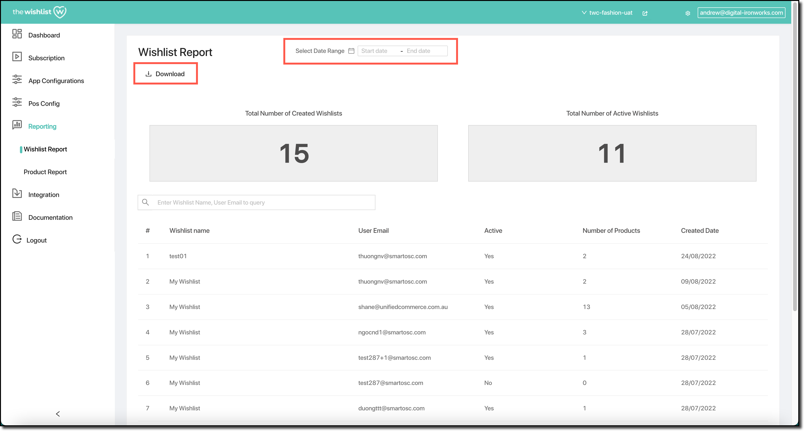

Two basic reports are provided for you to monitor wishlists and the products they contain.

- The **Wishlist Report** provides a summary of the wishlists that customers have created, and how many are active. It also gives you a snapshot of which customers those wishlists belong to, and how many products they have.
- The **Product Report** gives you a view of the products that you have on your storefront, and how those products have been added to customer wishlists.

## Date range and Download

Both reports can be refined to show data for a particular date range, and both can be downloaded.

By default, the date range is empty. This will cause the report to be based on _all_ customer activity. If you wish to restrict this to a particular timeframe, you can supply a start and end date. To view products added to wishlists for the last week, for example, you could add today's date as the “end date” and the date one week ago as the “start date”. The report would then reflect customer behaviour over the past week.

If you elect to download the data for a report, an email will be sent to you containing the report data.

## Wishlist Report

The wishlist report allows you see a summary of what wishlists your customers have created.

You can see:
- The total number of wishlists that customers have created.
- The number of wishlists that are active (i.e., have at least one product in them).

You can also see the details for customers who have wishlists. For each customer, you can see:
- The customer's wishlist name;
- The customer's email address;
- An indication of whether their wishlist is active or not;
- The number of products in their wishlist; and
- The date the customer created their wishlist (formatted as `dd/mm/yyyy`).

You're also provided with the ability to search for a particular wishlist by either wishlist name or customer email address. Rather than having to scroll through hundreds of wishlists, this can help you find the wishlist you're looking for quickly.

You can make use of partial matches — the search function will find all wishlists whose name or owning customer's email address contains the search term anywhere. The following diagram illustrates:

## Product Report

The product report allows you to see a summary of your available products and how customers have added them to their wishlists.

You are provided with a list of products on your storefront. For each one, you can see:
- The product's image, name, and SKU;
- The number of times the product has been added to a customer's wishlist;
- The number of times the product has been added to a customer's cart from their wishlist; and
- The date the product was last added to a customer's wishlist (formatted as `dd/mm/yyy`).

Because you may have a significant number of products available, you can search for those products by either name or SKU. Partial names work too — searching for `Large`, for example, finds all products with `Large` anywhere in their name.

