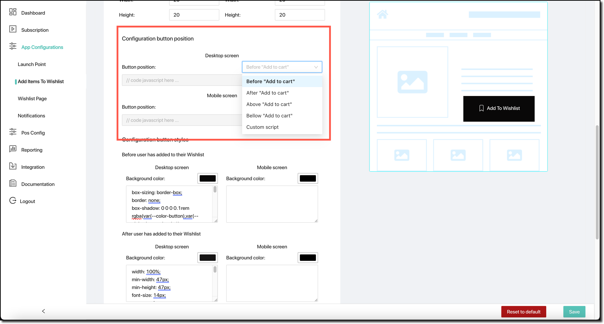
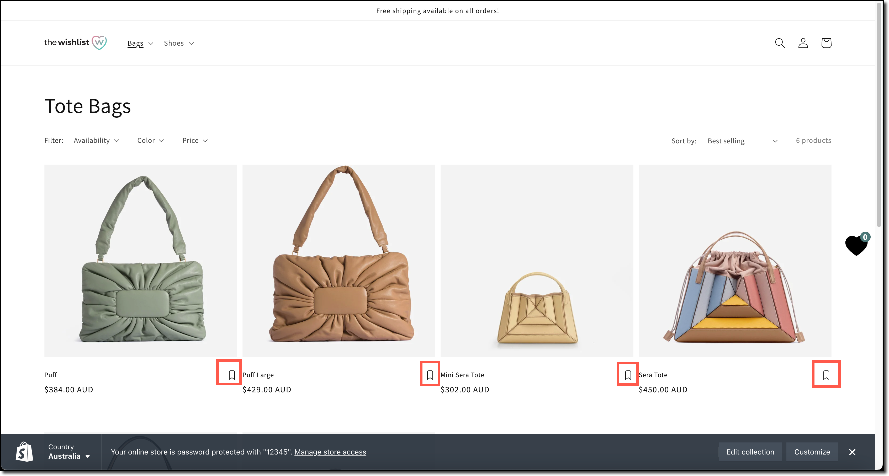
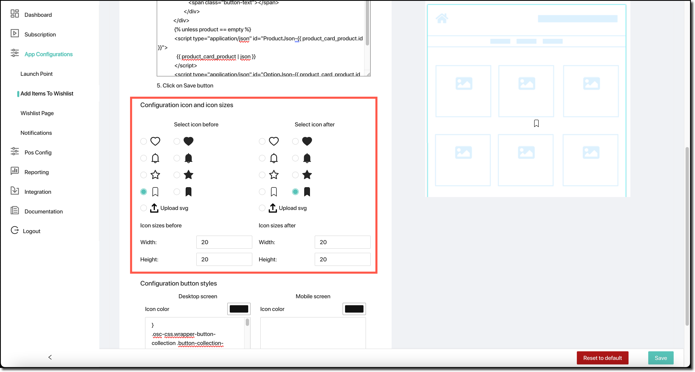
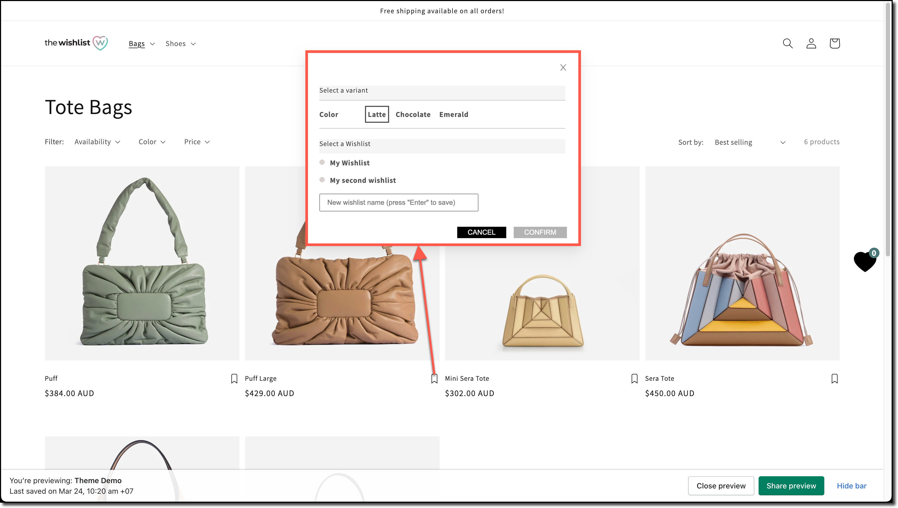

 
The **Add Items to Wishlist** configuration is used to describe the way a customer is able to add items to their wishlist.

There are four different configurations related to this:

- The details displayed on a [product detail page](#product-detail-page) — that is, when the customer is viewing a specific product;
- The details displayed on a [collections page](#collection-page) — when the customer is looking at the range of bags available, for example;
- The way in which the [“Add to Wishlist”](#add-to-wishlist-popup) popup is configured when required; and
- The configuration of the transient [confirmation popup](#confirmation-popup) displayed when a customer has added an article to their wishlist.

These four sections of the configuration are available by opening the appropriate section of the page.


## Product Detail Page

When a customer is viewing a product detail page within your shop, it's important that they are able to add that article to their wishlist in case they're interested but not yet ready to purchase.

To achieve this, The Wishlist can inject “add to wishlist” functionality into the product detail page. This can be configured in a number of ways.

### Button styling

There are five different button styles supported:
- Button background, icon, and label
- Button background and label
- Button outline, icon, and label
- Button outline and label
- Icon only

You can select one of these five:


### Button Icon and sizing

If you're using a button style that incorporates an icon, you can choose the icon to display, its colour, and the icon size. This can be specified for both the before and after icons.
- The “before” icon is used before the customer has added the article to their wishlist.
- The “after” icon is used after the customer has added the article to their wishlist.

Both have the same options available.

- You can select the icon using as one of four built-in icons: a heart, a bell, a star, or a ribbon. You can also upload a custom `.svg` file that contains the icon to display.
- You can change the colour of the icon, along with the size use to display it (width and height).

These options are illustrated below:


### Button position

The button position within the product detail page can be customised. There are four built-in options, or you can supply a Javascript snippet that will be injected into the page to load and position the button.

The five options are:
- `Before “Add to Cart”`;
- `After “Add to Cart”`;
- `Above “Add to Cart”`;
- `Below “Add to Cart”`; or
- `Custom script`.

These can be selected (and can be different for) both desktop class devices and mobile devices.



In this example, the Add to Wishlist button has been configured to be displayed after the add-to-cart button:


Changing it to below the add-to-cart button has a different outcome:


#### Custom script — using Javascript to position the button

Using Javascript to position the button is a more advanced option. It requires you to write a small amount of Javascript code that will be executed when the page is loaded. This code will need to find the element that contains the “Add to Cart” button, and then insert the “Add to Wishlist” button after it.

The following code is an example:

```js
ucPositionButtonWLDetail = document.querySelector(".product__info-container > .product__title");
ucPositionButtonWLDetail.insertAdjacentElement("afterend", window.UC_BUTTON_WL_DETAIL);
```

### Custom button styling with CSS

You can apply custom styling to the Add to Wishlist by providing a background colour and a CSS snippet that is executed. There are actually four sets of these:
- Before user has added to their wishlist, desktop;
- Before user has added to their wishlist, mobile;
- After user has added to their wishlist, desktop; and
- After user has added to their wishlist, mobile.

These are illustrated below:


Note: The size break used to determine whether the desktop or mobile styling is used is 576px. Devices with a screen width greater than 576px will use the desktop styling, and those with a screen width equal to or less than 576px will use the mobile styling.

### Button text and font

Finally, you can configure the text that's displayed on the Add to Wishlist button, along with the font that's used. There are two text options: the text to display before the customer has added the item to the wishlist, and the text to display after it's added. You can also change the colour of the text (and it can be different before and after).

The screenshot below illustrates these options:


## Collection page

You can optionally inject an “Add to Wishlist” icon on your shop's collection pages. If enabled, each collections has the add to wishlist icon included along with each item's image.

The following example illustrates:



### Rendering the button

A small amount of additional HTML needs to be added to the product card HTML to enable the button to be shown. To achieve that, the following steps should be followed.

1. Go to your Shopify store administration page.
2. Select `Online Store` → `Actions` (within your Current Theme) → `Edit Code`.
3. Open the `Snippets` folder, then locate and open the `product-card.liquid` file.
5. Within this file, find the HTML element `<div class="card-information__wrapper">`.
6. Immediately below that line, paste in the HTML code snippet shown on the Collection Page configuration.
7. Save your changes.

The following screenshot illustrates where the required HTML can be found:


Once these changes are made, the wishlist button will be shown on each item on your shop's collections page.

### Selecting the icon

Once you have made the HTML changes to show a wishlist button on your collections page, you can then configure the way that button is shown.

The first step is to select the icon that is used for the button. You can choose from four builtin icons (heart, bell, star, or ribbon), or upload your own `.svg` icon file. Each of the builtin icons is available as either an outline or a filled icon.

You can also specify the size of each icon by defining its width and height.

Each of these configuration options is available for two separate wishlist button representations: one before the customer has added an item to their wishlist, and one used after the customer has added the item to their wishlist.

The following screenshot illustrates:



### Configuring the button

Finally, having added the button to the product card within your collections, and configuring the icon associated with the button, you can configure the button's characteristics.

You can select the colour used to display the icon within the button, and you can specify some custom CSS to modify the button's behaviour. The CSS can be provided for both desktop and mobile customers.


## Add to Wishlist popup

When a customer adds something to their wishlist, a popup window is presented to them so that they can select the article variant (colour, style, etc) and the wishlist they want to add the item to. The following example illustrates:



### Configure variant popup

The top area of the popup, showing the variant selection, can be configured using a title, HTML fragment, and colour selection.


- The variant popup title can be configured. In the example above, it's set to “Select a variant”.
- The HTML used to present the variants can be provided. This shows the list of variants — in this example, colours. This is described in more detail below.
- The colours used for the variant popup title can be configured — both the text colour and background colour. This can be set for both the desktop and mobile class devices.

The default HTML template is shown below:

```html
<h4 class="wishlist-title" variant_title></h4>
<div class="variant-list" option_list>
  <div class="form-group" option_item>
    <label>{{option_name}}</label>
    <div class="form-control">
      <div class="variant-item-list" value_list>
        <label class="variant-item" value_item>
          <input type="radio"
                 class="variant-item-input"
                 name="{{option_name}}"
                 id="{{option_value}}">
          <span>{{option_value}}</span>
        </label>
      </div>
    </div>
  </div>
</div>
```

There are several important characteristics of the HTML template that is used.

1. The heading must use the `wishlist-title` class and reference `variant_title` to correctly show the title text in the configured style.
2. The list of options presented must include `{{option_name}}` and `{{option_value}}` to correctly pick up the variant name and value.

### Configure wishlist popup

The next area of the popup, showing the wishlist to add the item to, can be configured using a title, HTML fragment, and colour selection.


- The variant popup title can be configured. In the example above, it's set to “Select a Wishlist”.
- The HTML used to present the wishlists can be provided. This shows the list of wishlists — in this example, two are shown. This is described in more detail below.
- The colours used for the wishlist popup title can be configured — both the text colour and background colour. This can be set for both the desktop and mobile class devices.

Note that the use of multiple wishlists is optional. If this is disabled, or the customer only has a single wishlist, this area of the wishlist popup will not be shown.
- Refer to [multiple wishlist](app-configuration-wishlist-page.md#multiple-wishlist) for details on multiple wishlists.

The default HTML template is shown below:

```html
<h4 class="wishlist-title" wishlist_title></h4>
<div class="wishlist-list" wishlist_list>
  <label wishlist_item>
    <input type="checkbox"
           class="wishlist-list-input"
           id="wishlist-item-{{wishlistId}}"
           name="wishlist-item-{{wishlistId}}"
           data-wishlist-default="{{is_default_wishlist}}">
    <span class="type-check"></span>
    <span class="title-wishlist" title="{{wishlist_name}}">{{wishlist_name}}</span>
    <div class="remove-variant" remove_variant>Remove</div>
  </label>
</div>
```

There are several important characteristics of the HTML template that is used.

1. The heading must use the `wishlist-title` class and reference `wishlist_title` to correctly show the title text in the configured style.
2. The list of options presented must use the `wishlist-list-input` class, and use `wishlist-item-{{wishlistId}}` as the `id` and `name` of the `<input>` element.
3. The description of each wishlist must be a span of type `title-wishlist`, with a title and span content of `{{wishlist_name}}`.
4. The default wishlist can be flagged with `{{is_default_wishlist}}`.

### Font

The font used for both the variant and wishlist areas of the popup can be defined using one of four options:

- `Inherit`, which means that the font is the same as the enclosing page;
- `Georgia`;
- `Verdana`; or
- `Garamond`.


## Confirmation popup

The confirmation popup is a transient popup shown to customers when they have added a product to their wishlist. It can be turned on or off as required, and the HTML layout of the popup can be completely configured.


### Enable/disable, and mobile settings

The configuration of this popup begins with two options that control when the popup is shown.

- “Display confirmation pop-up when user added an item successfully to their Wishlist”
	- Use this switch to either enable or disable the display of the confirmation pop-up.
- “Display full pop-up on mobile (hide product details if "disabled")”
	- Use this switch to select between the full popup (including product details) being shown on a mobile device. If it's turned off, mobile devices show a more compact confirmation popup.

### Icon

The icon shown in the confirmation popup heading can be customised. You can choose from four builtin icons (heart, bell, star, or ribbon) in either an outline or filled style. You can also upload a custom `.svg` file that holds the icon you want to use.

You can choose the icon size — the default is 20⨉x20.

### Background colour, text, and location

The next option is to choose the background colour for the confirmation popup. The default is `#000000` (black), but this can be changed as required. The following example shows the selection of a green colour:


You can also change the text that is displayed in the foreground of the popup. The default is `This item has been added to your Wishlist`, but this can be customised as required.

Finally, you can select the location that the popup appears in. There are four options: bottom left, bottom right, top left, and top right. The default is top right.

### HTML template

You can completely customise the HTML template used to display the confirmation popup. The default HTML code is shown below:

```html
<div class="toast__title-container" toast_title_wrapper="">
  <div class="title__content">
    <div class="container_content__logo"></div>
    <p class="content__title" toast_title=""></p>
  </div>
  <span class="title__btn-close" toast_close="">×</span>
</div>
<div class="toast__body">
  <div class="body_container">
    <div class="body__product-image" toast_product_img_wrapper="">
      
    </div>
    <div class="body__product-wapper-detail">
      <div class="body__product-detail" toast_product_detail="">
        <div class="body__product-name">
          {{product_name}}
        </div>
        <div class="body__product-price">
          {{product_price}}
        </div>
      </div>
      <div class="footer__toast">
        <span class="btn-view" toast_view_wishlist="">View your wishlist</span>
      </div>
    </div>
  </div>
</div>
```

You should use this as the basis for your confirmation popup, and customise it as required. It's important that the core elements are preserved to allow the article's image, name, and price to be displayed.

- The `toast__title-container` division tag represents the strip across the top of the popup, containing the icon (`container_content__logo`), the title text (`content__title`) and the close button (`title__btn-close`).
- The `toast__body` division tag represents the remaining body of the popup, including the image (`body__product-image`), the product name (`body__product-name`) and the price (`body__product_price`). Within the body, there is a nested division representing the footer (`footer_toast`) — by default, this contains a link to take the customer to their wishlist.

You can also supply some custom CSS that applies to both desktop and mobile devices. By default, this is blank, but you can use it as required.


### Font

As with many other configuration areas, you can choose the font used for the popup. It can be defined using one of four options:

- `Inherit`, which means that the font is the same as the enclosing page;
- `Georgia`;
- `Verdana`; or
- `Garamond`.
