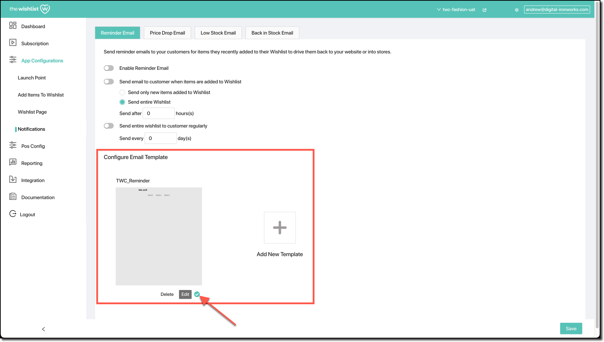
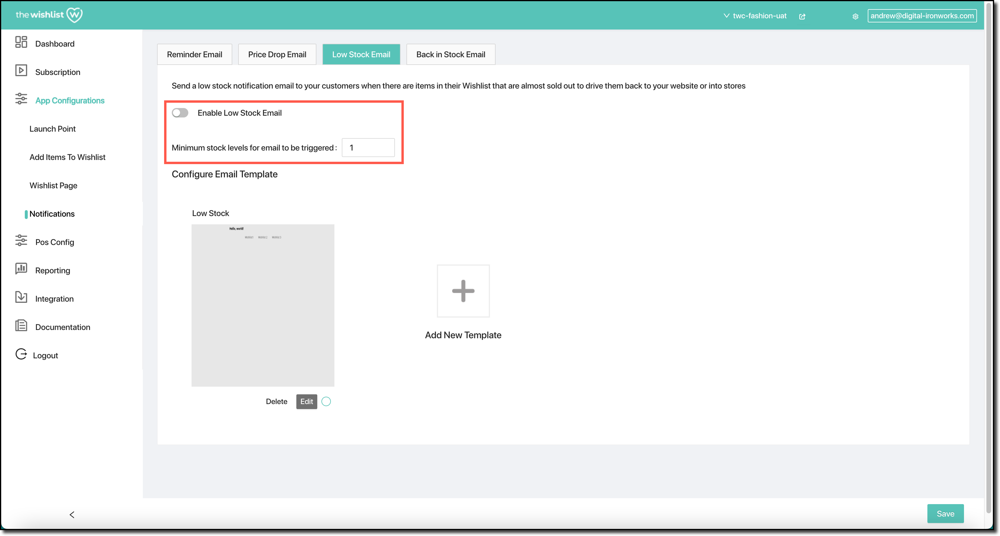

The **Notifications** page of the configuration allows you to customise the way customers are notified about events related to their wishlist. There are four separate mechanisms:

- The [reminder](#reminder-email notification can be used to regularly remind a customer about products in their wishlist;
- The [price drop](#price-drop-email) notification can be used to send customers a notification when the price of a product in their wishlist has been reduced;
- The [low stock](#low-stock-email) notification can be sent when a product in a customer's wishlist is selling out; and
- The [back in stock](#back-in-stock-email) notification can be sent when a product in a customer's wishlist is now back in stock.

All four notifications are email based, and will send the email to a customer who has some of your store's products in their wishlist.

Each notification is based on an email template. You can have multiple templates for each notification, but only one is selected as the active template. This is indicated by a green tick:

A full description of the way to edit email templates is beyond the scope of this documentation. The email template editor used by the wishlist is provided by unlayer — their documentation on editing templates can be found at https://unlayer.com/.

## Reminder Email

The **reminder** email can be used to periodically remind customers of products that they have stored in their wishlist. There are several settings available for this email notification.

An option is provided to turn the reminder notification on or off. If it's off, customers will not get reminded, but if it's turned on, they will be. You can use the rest of the options to determine how often they are reminded.

The “Send email to customer when items are added to Wishlist” option can be turned on if you want to send the customer an email after they've added something to their wishlist. You can elect to either send just the product(s) they've added, or their entire wishlist. In addition, you can specify how many hours this reminder email should be delayed.

You can also elect to send the customer their entire wishlist on a regular basis — for example, every 30 days. This can be controlled with the “Send entire wishlist to customer regularly” option.

Both options use the same email template.

## Price Drop Email

The **price drop** email can be used to send customers an email notification when the price of one or more products in their wishlist is reduced. This gives the customer an incentive to visit your website and make a purchase from their wishlist.

You can turn on this price drop email using the “Enable Price Drop Email” option.

## Low Stock Email

The **low stock** email can be used to notify customers when a product in their wishlist is low in stock. It can encourage customers to complete their purchase before the product is sold out.

If this reminder email is turned on, you can determine the low-stock level at which customers receive the email. If the minimum stock level is set to `1`, for example, customers will receive the reminder email once available stock drops to an available quantity of 1.

## Back in Stock Email

The **back in stock** email can be used to tell customers when a product in their wishlist has come back into stock. If a customer has been unable to purchase the product because it's been out of stock, this can offer encouragement for them to now complete their purchase.

When turned on, you can determine the minimum stock level at which a customer is emailed about the product being back in stock. Selecting `1` would email them as soon as at least one has been received; for a highly popular article that has high turnover you may wish to select a higher level.