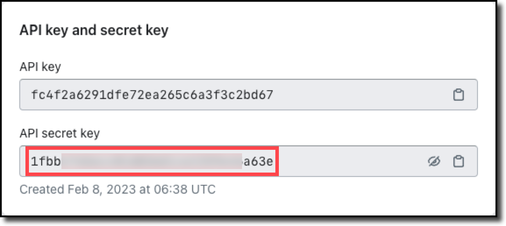

This guide will describe the way in which The Wishlist can be installed in your Shopify store. To be able to undertake this, you will need administrative privileges for your store.

There are a few steps required for this installation:

1. Log into Shopify as an administrator
2. Create a “Custom Application”
3. Configure the privileges required for The Wishlist to be able to operate for your store
4. Capture the store credentials and pass them to The Wishlist Co to complete the installation

The following details describe each of these steps in detail.

## Login

The first step required when installing The Wishlist is to log into Shopify using an account that has administrative privileges.

At the Shopify login prompt, enter your credentials.

## Create application

Once you're logged into Shopify using an adminstrative account, you will be able to create a custom application to install The Wishlist.

In the menu on the left-hand-side of the screen, choose **Settings**.

When the settings page is displayed, select **Apps and sales channels**.

Next, pick the **Develop apps** button.

Note: If this is the first time you have created a custom application, then you will be shown an intermediate screen that confirms you want to start developing apps on your store. You will need to enable custom app development by clicking the **Allow custom app development** button.

The next step is to create the basis of the custom application, so click the **Create an app** button.

You'll next be asked to enter the application details.

1. The application name can be anything of your choice, and will be used to identify The Wishlist application from this point on. Choosing The Wishlist would be a good choice.
2. Select the application developer. This can be the email address of the store owner, or any account associated with the store that has the **Develop apps** permission.

Your custom application has now been created.

## Capture required privileges

When you first create your custom application, you will be show the application configuration screen. It has four tabs:

- Overview
- Configuration
- API Credentials
- App settings

By default, you'll be on the **Overview** tab. On that tab, there's a button labelled **Configure Admin API Scopes**. Click that button.

## Administration scopes

When you click that button you will be shown a long list of all the possible “scopes” that are available for a Shopify store. These are analogous to the functions that an online store can perform — reading customer details, understanding browser analytics, applying discounts, etc.

As you scroll through the scopes, you will need to select the scopes that The Wishlist requires in order to operate correctly. For most of these, both read and write permission is required. When you select the “write” permission, the “read” permission will be automatically selected for you.

The following scopes are required:

- Reading and writing customer details

- Reading and writing inventory details

- Reading and writing locations

- Reading customer orders

- Reading and writing product listings

- Reading and writing products

- Reading and writing script tags

- Reading shop locales

- Reading and writing store content

When you have selected all of the correct scopes, click the **Save** button.

Note: There are 16 scopes that should have been selected — you can verify this by checking how many Shopify indicates have been selected.

## Installation

After you save your changes, Shopify will confirm the selected scopes, and offer you a button to install the application. Click that **Install app** button.

When you click the install button, Shopify will confirm that you want to install the application. Click **Install**.

## API credentials

Once the application has been installed, you'll see a screen that offers some API credentials. These are settings that The Wishlist Co needs in order to configure The Wishlist to work with your Shopify store.

The Wishlist Co needs four things to complete your installation — the domain for your Shopify store, and the three values available from this API credentials screen.

### Store domain

You need to provide The Wishlist with your Shopify store domain, in the format `«store».myshopify.com`, where `«store»` is your store's details. This value can be seen at the top of the setting screen.

### Admin API access token

NOTE: This API token is only accessible **once**. It is strongly suggested that you copy and paste this somewhere safe, or at least take a screenshot. The Wishlist needs this token to be able to integrate to your Shopify store.

Click the “Reveal once” button. and you'll see the token. It will be in the format `shpat_«value»`, where `«value»` is a series of 32 characters that is unique to your store.

### API key

The API key for your store is also required. This can be seen on the API credentials page. This is another series of 32 characters that is unique to your store. It should be visible.

### API secret key

The API secret key for your store is also required. This will be hidden by default — you can click the eye icon to see it, or click the clipboard icon to copy it.

## Register an account to administer the app 

The Wishlist can now push the app to your Shopify site, using the credentials you provided. The next step is for you to register an account to administer the app.

Enter your details here: <https://sc.au-aws.thewishlist.io/auth/sign-up> (add the API you used for the initial setup on your Shopify site)

You can then use <https://sc.au-aws.thewishlist.io/auth/sign-in> when you want to administer the app. 

> Only **one user per site** can be registered.
